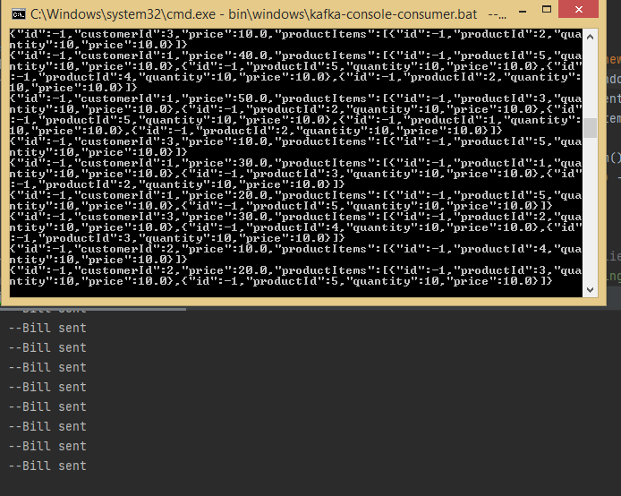

Dans l'application le client ne connaise que le service Gatway,tout les requêtes envoyer par le client suivi par le nom de service sont envoyer vers le Gateway(proxy),
et le moment quand le gateway connait le service il va contacter le micro-service d'enregistrement pour lui fournir tous les informations de micro-service pour ce communiquer directement avec le service demander par le client.
Pour éviter de créer un fichier de configuartion de chaque micro-service, on utilise un service de configuration.
On utilise Rest pour la communication entre les services c'est une communication synchrone.
## Micro-services (Customer,inventory et billing)
dans ces services, j'ai effectué un travail régulier de création de microservices simples (création d'objets dto, d'objets openfeign, de mappeurs de structures()strct mappers,JPA repositories, les entités et de contrôleurs)
#### Customer
DB name : customer-db 
Port: 8081
#### Inventory
DB name : inventory-db 
Port: 8083
#### Billing
DB name : billing-db 
Port: 8082

## Eureka service :
Port: 8761

Dans ce service, j'ai configuré un service de discovery avec lequel tous les services vont s'enregistrer

## Gateway service:
Port: 8888

le service gateway joue le rôle d'interface pour tous les services, de sorte que le client n'a à connaître qu'une seule adresse et à lui faire des requêtes

## Front-end
j'ai utilisé le framework React pour créer un front-end pour ce projet

## Facturations Producer
dans cette partie j'ai essayé d'implémenter un service qui simule un producteur de kafka qui envoie des factures à un topic kafka

## Facturations Consumer
dans cette partie, j'ai essayé d'implémenter un service qui reçoit des messages d'un topic kafka (envoyé par le simulateur de producteur) et les écrit dans un fichier csv

## Real-time Analytics
Dans cette section, j'ai essayé de faire des analyses en temps réel à l'aide de kafka streams, et la tâche consistait à calculer le nombre de facturations et le montant total à payer pour chaque client pour les 5 dernieres secondes

## Batch-processing
dans cette section, j'ai essayé d'effectuer un batch preocessing à l'aide du spring batch et la tâche consistait à calculer une remise de 30% sur toutes les factures

